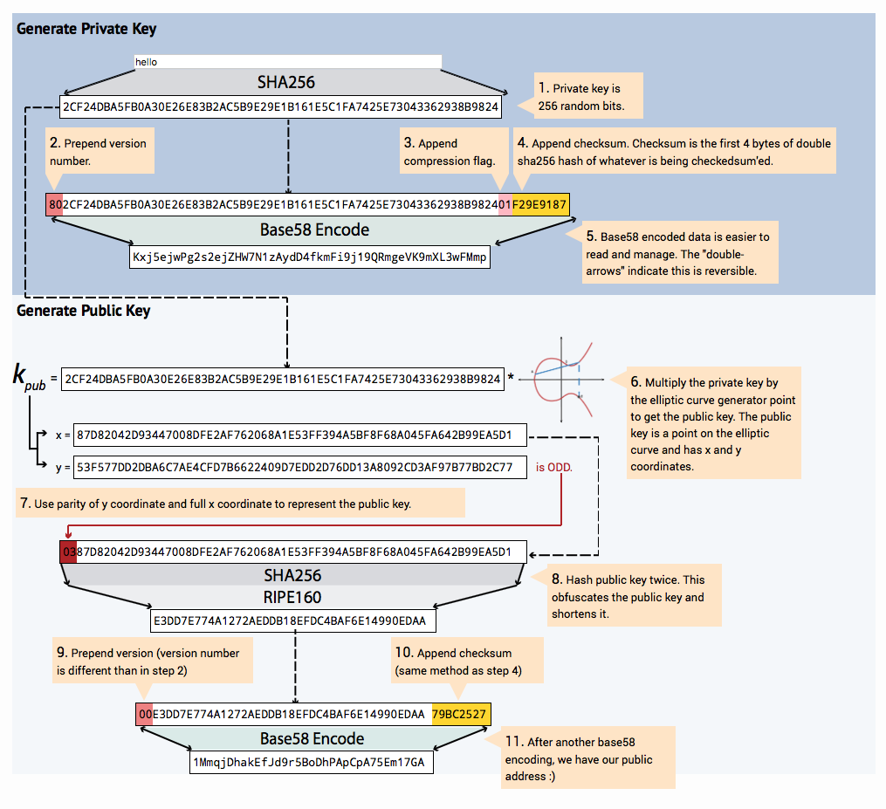

# Wallets
Node.js **module** for any cryptocoin's wallets

- Generate your own wallet address
- Configure your own wallet address rules
- Validate wallet's address

## Console Playground

```javascript
npm start
```

## Wallet Config
**Example:** _bitconnect.config_

```json
{
  "addressVersion": 18,
  "privkeyVersion": 146,
  "base58Str": "123456789ABCDEFGHJKLMNPQRSTUVWXYZabcdefghijkmnopqrstuvwxyz"
}
```
## Wallet Address

